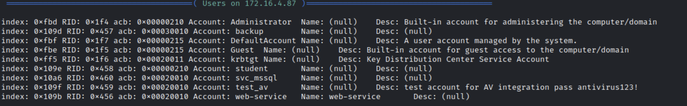

## Active Directory Lab

we started by scanning the IP using `nmap`:

        nmap -A [IP]

the result was:

using `enum4linux` and the credentials from description Username:`LAB\student` Pass:`hsxGs_72$` :

        enum4linux -a -u LAB\student -p hsxGs_72$ [IP]

`enum4linux` is a command-line tool that is used to enumerate information from `Windows` and `Samba` systems. It is a wrapper script that combines a number of other tools, including `rpcclient`, net, and `nmblookup`, to gather information about a remote system.

we got this result in enum of users:

as you see we got the password of `test_av` in the description of `test_av`, we can use it to log in as Administrator because `test_av` is a member of `Domain Admins` group.

as you see we have port 3389 open, so we can use `rdesktop` to connect to the machine.

        rdesktop -u LAB\test_av -p antivirus123! [IP]

after connecting we got a message that the password is expired, so we need to change it.

after successfully changing the password we got our user in.

in Desktop of the Administrator we got our flag.
