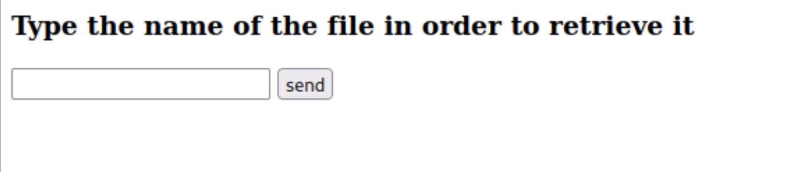
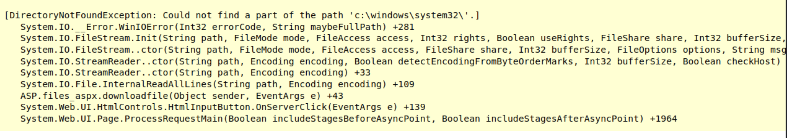

## Second machine

We started by running `nmap` to scan the machine:

    nmap -A [IP] -Pn

nmap results:

    PORT      STATE SERVICE            VERSION
    80/tcp    open  http               Microsoft IIS httpd 8.5
    |_http-server-header: Microsoft-IIS/8.5
    | http-methods:
    |_  Potentially risky methods: TRACE
    |_http-title: IIS Windows Server
    135/tcp   open  msrpc              Microsoft Windows RPC
    139/tcp   open  netbios-ssn        Microsoft Windows netbios-ssn
    445/tcp   open  microsoft-ds       Microsoft Windows Server 2008 R2 - 2012 microsoft-ds
    3389/tcp  open  ssl/ms-wbt-server?
    | ssl-cert: Subject: commonName=WIN-0CHLK1AJTI8
    | Not valid before: 2023-01-01T12:23:51
    |_Not valid after:  2023-07-03T12:23:51
    |_ssl-date: 2023-01-02T17:39:30+00:00; 0s from scanner time.
    | rdp-ntlm-info:
    |   Target_Name: WIN-0CHLK1AJTI8
    |   NetBIOS_Domain_Name: WIN-0CHLK1AJTI8
    |   NetBIOS_Computer_Name: WIN-0CHLK1AJTI8
    |   DNS_Domain_Name: WIN-0CHLK1AJTI8
    |   DNS_Computer_Name: WIN-0CHLK1AJTI8
    |   Product_Version: 6.3.9600
    |_  System_Time: 2023-01-02T17:38:50+00:00
    49154/tcp open  msrpc              Microsoft Windows RPC
    49155/tcp open  msrpc              Microsoft Windows RPC
    49163/tcp open  msrpc              Microsoft Windows RPC
    Service Info: OSs: Windows, Windows Server 2008 R2 - 2012; CPE: cpe:/o:microsoft:windows

    Host script results:
    | smb-security-mode:
    |   account_used: guest
    |   authentication_level: user
    |   challenge_response: supported
    |_  message_signing: disabled (dangerous, but default)
    |_nbstat: NetBIOS name: WIN-0CHLK1AJTI8, NetBIOS user: <unknown>, NetBIOS MAC: 06:b3:d0:29:70:d8 (unknown)
    | smb2-security-mode:
    |   3.0.2:
    |_    Message signing enabled but not required
    | smb2-time:
    |   date: 2023-01-02T17:38:51
    |_  start_date: 2023-01-02T17:30:24

as we can see, there is a web server running on port 80, there is nothing interesting on the website, beside the fact that it is running on ASP.NET. so we can try to enumerate the website using `dirb`:

    dirb http://[IP] -X .aspx

dirb results:

    ---- Scanning URL: http://172.16.4.109/ ----
    + http://172.16.4.109/download.aspx (CODE:200|SIZE:1538)
    + http://172.16.4.109/Download.aspx (CODE:200|SIZE:1538)
    + http://172.16.4.109/files.aspx (CODE:200|SIZE:1547)

we can see that there is a `files.aspx` page, so we can try to access it:

i tried to type `../` in the input box then something interesting happened:

`i understand that the code is trying to access a file that is located in the system32 directory, but the file does not exist.`

so i tried to input the full path to the flag file:

    C:\Users\Administrator\Desktop\proof.txt

then easily got the flag.
